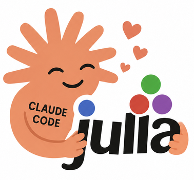

I've been using Claude Code with Julia, and the main pain point was startup time. Every test run pays Julia's compilation tax — a simple `include("runtests.jl")` can take 30+ seconds before any code actually runs. Over dozens of iterations in a session, that adds up.

I wrote [julia-daemon](https://github.com/samuelcolvin/julia-daemon) to deal with this. It keeps a Julia process running in the background so that subsequent calls skip startup entirely. State, loaded packages, and compiled code all persist between calls. The code is based on [julia-mcp](https://github.com/aplavin/julia-mcp), which is a similar approach using an MCP server. But as CLIs are generally replacing MCP use nowadays, I figured I'd make a simple daemon instead. 

## How it works

julia-daemon has two components:

- **julia-server** — a background daemon that manages persistent Julia sessions
- **julia-eval** — a CLI client that sends code to the daemon for evaluation

Each project directory gets its own isolated Julia process. The daemon communicates over a Unix socket, starts sessions on demand, and recovers from crashes. If [Revise.jl](https://github.com/timholy/Revise.jl) is installed, code changes are picked up without restarting the session.

## Setup

### Install julia-daemon

```bash
uv tool install julia-daemon
```

I also have Revise.jl in my global Julia environment so code changes get picked up automatically.

### Run the server in the background

The server needs to be running before calling `julia-eval`. I run it as a system service so it starts on boot and stays out of the way.

**macOS (launchctl):**

Create `~/Library/LaunchAgents/com.julia-daemon.plist`:

```xml
<?xml version="1.0" encoding="UTF-8"?>
<!DOCTYPE plist PUBLIC "-//Apple//DTD PLIST 1.0//EN" "http://www.apple.com/DTDs/PropertyList-1.0.dtd">
<plist version="1.0">
<dict>
    <key>Label</key>
    <string>com.julia-daemon</string>
    <key>ProgramArguments</key>
    <array>
        <string>/path/to/julia-server</string>
    </array>
    <key>RunAtLoad</key>
    <true/>
    <key>KeepAlive</key>
    <true/>
    <key>StandardOutPath</key>
    <string>/tmp/julia-daemon.stdout.log</string>
    <key>StandardErrorPath</key>
    <string>/tmp/julia-daemon.stderr.log</string>
</dict>
</plist>
```

Then load it:

```bash
launchctl load ~/Library/LaunchAgents/com.julia-daemon.plist
```

(Replace `/path/to/julia-server` with the actual path — `which julia-server` will show it.)

**Linux (systemd):**

Create `~/.config/systemd/user/julia-daemon.service`:

```ini
[Unit]
Description=Julia Daemon

[Service]
ExecStart=/path/to/julia-server
Restart=always

[Install]
WantedBy=default.target
```

Then enable and start it:

```bash
systemctl --user enable julia-daemon
systemctl --user start julia-daemon
```

## Using it with Claude Code

The pattern I've settled on: write test logic as a Julia module in the project's `test/` directory, then tell Claude Code to run it via `julia-eval`.

### 1. Create a test module

For example, `test/TestRunner.jl`:

```julia
module TestRunner

using Test
using MyPackage

function main()
    @testset "MyPackage tests" begin
        @testset "basics" begin
            @test my_function(1) == 2
            @test my_function(0) == 1
        end

        @testset "edge cases" begin
            @test_throws ArgumentError my_function(-1)
        end
    end
end

end
```

The module structure matters here. Revise.jl tracks modules, so changes to `TestRunner.jl` or to `MyPackage` itself get picked up automatically on the next call — no restart needed.

### 2. Configure CLAUDE.md

I add this to my project's `CLAUDE.md`:

```markdown
To run tests, use:
julia-eval --env-path test 'using TestRunner; TestRunner.main()'
```

The first run activates the environment and compiles everything. Every run after that is nearly instant. 

### Notes

- I keep `main()` as the default entry point, but I also add more specific functions to the module (e.g., `test_parsing()`, `test_io()`) when I want Claude to run a subset.
- `--env-path test` points at the `test/` directory. julia-daemon activates the parent project and loads test dependencies automatically.
- If something gets into a bad state, `julia-eval --restart --env-path test` gives a fresh session.
- The default timeout is 60 seconds. For longer test suites, `--timeout 120` or whatever is appropriate.

## Debugging with Infiltrator.jl

Because the session is persistent, I can also use [Infiltrator.jl](https://github.com/JuliaDebug/Infiltrator.jl) for interactive debugging. If I place a `Main.@infiltrate` breakpoint in my code, the `julia-eval` call will complete as normal, but will inform me that a debugging session has started. Other `julia-eval` calls can query items in the problematic stack frame. Finally, a call to `julia-eval --interrupt` will exit the infiltration context and let execution continue.

## Why this matters

The reason I built this is that fast feedback loops are what make Claude Code effective with languages like Python and JavaScript. Without something like julia-daemon, Julia projects hit a wall — Claude has to wait 30+ seconds per test run, which makes the iterative style of development that works so well elsewhere impractical. With the daemon running, Claude can make a change, test it, and adjust in a tight loop, same as with any other language. The persistent session is also useful for interactive exploration. Claude can evaluate expressions and inspect state without paying startup costs each time.
