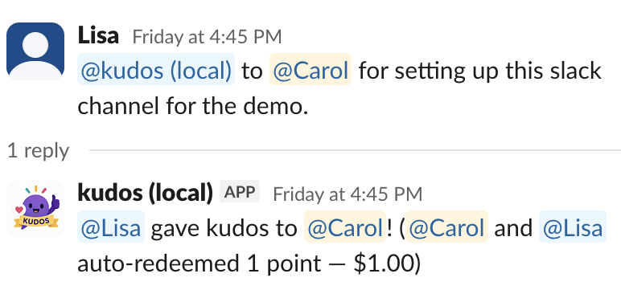

At a recent work hackathon I built a Slack bot where people give each other kudos -- short public messages like "@kudos @jane Great job leading the incident retro" -- and those kudos convert to small dollar payouts. The whole thing is a Slack bot, a Postgres database, and a dashboard. Nothing groundbreaking, but I ran into a few design problems that were more interesting than I expected.

<div style="text-align: center;">

</div>

```{python}
#| label: setup
#| echo: false
#| code-summary: "Database connection"
import os
import numpy as np
import pandas as pd
import matplotlib.pyplot as plt
from scipy import stats
from dotenv import load_dotenv
from psycopg_pool import ConnectionPool
import psycopg
from pgvector.psycopg import register_vector

load_dotenv()
pool = ConnectionPool(os.environ["DATABASE_URL"], configure=register_vector)

def query(sql):
    with pool.connection() as conn:
        conn.row_factory = psycopg.rows.dict_row
        return pd.DataFrame(conn.execute(sql).fetchall())
```

## Reciprocity pairing in SQL

The first question was: how do you get people to participate? If people don't get rewarded for giving kudos but only for receiving them, there's no reason for anyone to recognize anyone else. The mechanism I landed on was a **give-to-earn** model: your nth give redeems your nth received kudos, paired 1:1, oldest first. You only get paid when you recognize others. It turns receiving kudos into a prompt to go give some --- and that keeps the whole thing circulating.

This turned out to be surprisingly clean to express as a SQL view. Two CTEs number each person's gives and receives independently, then a join on `giver_id = recipient_id AND gives.rn = receives.rn` pairs them up:

```sql
CREATE VIEW to_redeem AS
WITH gives AS (
    SELECT id, giver_id,
           ROW_NUMBER() OVER (PARTITION BY giver_id ORDER BY created_at, id) AS rn
    FROM kudos WHERE redeems IS NULL),
receives AS (
    SELECT id, recipient_id,
           ROW_NUMBER() OVER (PARTITION BY recipient_id ORDER BY created_at, id) AS rn
    FROM kudos WHERE redeemed_at IS NULL AND NOT overflow)
SELECT gives.id AS give_id, receives.id AS receive_id,
       ROW_NUMBER() OVER (ORDER BY gives.id) AS rn
FROM gives JOIN receives
  ON gives.giver_id = receives.recipient_id AND gives.rn = receives.rn;
```

The outer `rn` matters because there's a monthly budget --- accounting sets how many kudos can actually be paid out. Once the budget is exhausted, any remaining pairs get marked as overflow: they're still recorded, but no money changes hands. The redemption function does both in a single UPDATE:

```sql
CREATE FUNCTION try_redeem(p_as_of TIMESTAMPTZ DEFAULT NOW())
RETURNS TABLE(redeemed_user_ids VARCHAR[], notify_budget_exhausted BOOLEAN) AS $fn$
DECLARE v_remaining INTEGER;
BEGIN
    PERFORM pg_advisory_xact_lock(hashtext('try_redeem'));
    v_remaining := remaining_budget(p_as_of::date);
    SELECT array_agg(give_id ORDER BY rn),
           array_agg(receive_id ORDER BY rn),
           array_agg(rn ORDER BY rn)
      INTO v_give, v_recv, v_rn
      FROM to_redeem;

    UPDATE kudos k SET redeems = p.receive_id
    FROM unnest(v_give, v_recv) AS p(give_id, receive_id)
    WHERE k.id = p.give_id;

    RETURN QUERY
    WITH redeemed AS (
        UPDATE kudos k SET redeemed_at = p_as_of, overflow = p.rn > v_remaining
        FROM unnest(v_recv, v_rn) AS p(receive_id, rn)
        WHERE k.id = p.receive_id
        RETURNING k.recipient_id
    )
    SELECT COALESCE(array_agg(DISTINCT recipient_id), '{}'),
           count(*) >= v_remaining AND v_remaining > 0
    FROM redeemed;
END;
$fn$ LANGUAGE plpgsql;
```

The line that does the work is `overflow = pairs.rn > v_remaining`: pairs past the budget cap get flagged in the same statement that stamps their `redeemed_at`. An advisory lock serializes concurrent calls so two simultaneous gives can't both sneak under a budget of 1.

I liked how this came together. The Python app is just a thin event router; all the invariants --- pairing, budget caps, overflow, concurrency --- live in Postgres. There's no application-level state to get out of sync.

## The small-count Poisson CI problem

This was the part that nerd-sniped me. The dashboard has a panel that estimates whether changing the conversion rate (dollars per kudos point) actually changes behavior. It's a textbook interrupted time-series setup: weekly counts, a Poisson GLM with an exposure offset for team size and holidays, successive-difference contrasts on the period indicator. Each coefficient is a log-IRR for one period vs. the previous.

$$
Y_w \sim \operatorname{Poisson}(\mu_w), \qquad
\log \mu_w = \log e_w + \mathbf{x}_w^\top \boldsymbol{\beta}
$$

The problem is that the counts are small. A team of 20--30 people generates maybe 5--15 kudos per week. And the default confidence intervals from `statsmodels` (or any GLM package) use the **Wald test** --- $\hat\beta \pm z_{\alpha/2} \cdot \text{SE}(\hat\beta)$ --- which assumes the MLE is approximately normal. At counts this low, was this reasonable?

I compared the confidence intervals from Wald tests to the **exact conditional binomial** interval. You condition on the total count $n = Y_1 + Y_2$; under the Poisson model, $Y_2 \mid n \sim \text{Binomial}(n, p)$ where $p = \rho \cdot e_2 / (e_1 + \rho \cdot e_2)$. The beta distribution gives you exact bounds on $p$, and you transform back to $\rho$:

```{python}
def irr_ci_exact(count2, exposure2, count1, exposure1, alpha=0.05):
    n, k = int(count1 + count2), int(count2)
    p_lo = stats.beta.ppf(alpha / 2, k, n - k + 1) if k > 0 else 0.0
    p_hi = stats.beta.ppf(1 - alpha / 2, k + 1, n - k) if k < n else 1.0
    to_rho = lambda p: p * exposure1 / ((1 - p) * exposure2) if p < 1 else float("inf")
    return to_rho(p_lo), to_rho(p_hi)

def irr_ci_wald(count2, exposure2, count1, exposure1, alpha=0.05):
    if count1 == 0 or count2 == 0:
        return (0.0, float("inf"))
    log_irr = np.log((count2 / exposure2) / (count1 / exposure1))
    se = np.sqrt(1 / count1 + 1 / count2)
    z = stats.norm.ppf(1 - alpha / 2)
    return np.exp(log_irr - z * se), np.exp(log_irr + z * se)
```

Here's what the two methods look like on the actual data, comparing each consecutive conversion-rate change:

```{python}
#| label: fig-wald-vs-exact
#| fig-cap: "Wald vs. exact (Clopper-Pearson) 95% confidence intervals for each consecutive conversion-rate change observed in the data."

weekly = query("SELECT * FROM weekly_kudos")
covs = query("SELECT * FROM covariates ORDER BY label, week")
pivoted = covs.pivot(index="week", columns="label", values="value")
weekly["exposure"] = weekly["yw"].map(
    (pivoted["workday_frac"] * pivoted["num_users"]).astype(float))
df = weekly.reset_index(drop=True)

import seaborn.objects as so

agg = df.groupby("conversion_rate", as_index=False).agg(
    count=("redeemed", "sum"), exposure=("exposure", "sum")).sort_values("conversion_rate")
t = pd.DataFrame({
    "count1": agg["count"].values[:-1], "exposure1": agg["exposure"].values[:-1],
    "count2": agg["count"].values[1:], "exposure2": agg["exposure"].values[1:],
    "transition": [f"{r1} \u2192 {r2}" for r1, r2 in
                   zip(agg["conversion_rate"].values[:-1], agg["conversion_rate"].values[1:])],
})
t = t[(t.exposure1 > 0) & (t.exposure2 > 0) & (t.count1 > 0)]
t["irr"] = (t.count2 / t.exposure2) / (t.count1 / t.exposure1)

def ci_cols(fn):
    return t.apply(lambda r: fn(r.count2, r.exposure2, r.count1, r.exposure1),
                   axis=1, result_type="expand")

long = pd.concat([
    t.assign(method="Wald", **dict(zip(["lo", "hi"], ci_cols(irr_ci_wald).values.T))),
    t.assign(method="Exact", **dict(zip(["lo", "hi"], ci_cols(irr_ci_exact).values.T))),
])

fig, ax = plt.subplots(figsize=(8, 5))
ax.axhline(1.0, color="grey", linestyle="--", linewidth=0.8)
(
    so.Plot(long, x="transition", color="method")
    .add(so.Range(linewidth=3), so.Dodge(), ymin="lo", ymax="hi")
    .add(so.Dot(color="black", pointsize=5), so.Dodge(), y="irr")
    .label(x="Conversion rate change", y="IRR (95% CI)", color="",
           title="Wald vs. exact binomial CI for each period transition")
    .on(ax).plot()
)
leg = fig.legends.pop()
ax.legend(leg.legend_handles, [txt.get_text() for txt in leg.texts])
plt.show()
```

It seems like the low counts don't matter much after all! A Wald test is just fine.
