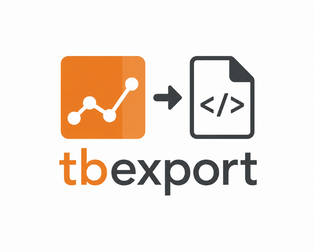

I've been writing up training results for blog posts and documentation a lot lately, and the workflow always felt clunky. TensorBoard is great for interactive exploration during development, but when it's time to publish, you either take screenshots or ask readers to run a TensorBoard instance themselves. Neither is ideal.

So I (or, more honestly, mostly Claude) wrote [tbexport](https://github.com/samanklesaria/tbexport), a small CLI that reads TensorBoard log directories and spits out static HTML files with the summaries you care about — scalar plots, images, and audio — ready to embed wherever you need them.


## What it does

You point it at a tfevents directory and tell it which tags to extract:

```bash
tbexport --log-dir ./logs \
  --scalars loss \
  --images gen_img \
  --audio gen_audio
```

For each tag, it produces an HTML file and an `_assets/` directory. Scalars get rendered as matplotlib plots. Images and audio with multiple steps get interactive scrubbers so readers can step through the training progression. The HTML is plain and unstyled enough to fit into most static site setups without fighting your existing CSS.

## Tag prefixes

If your logs have grouped tags like `train/loss`, `train/accuracy`, `train/lr`, you can pass just the prefix:

```bash
tbexport --log-dir ./logs --scalars train
```

This matches all sub-tags and groups them into a single page with a table layout, which is handy for showing related metrics together.

## Getting it

It's not on PyPI yet — for now you install from source:

```bash
git clone https://github.com/samanklesaria/tbexport.git
cd tbexport
uv tool install .
```

The code is straightforward and the scope is intentionally small. If you have ideas or run into issues, feel free to open an issue on GitHub.
